# HomeLab SIEM

A self-hosted **Security Information & Event Management** system built in pure Python,
now deployed cloud-natively on **Oracle Cloud Infrastructure (OCI)** via Kubernetes (k3s).
Designed to learn cybersecurity and platform engineering hands-on — log collection,
threat detection, runtime security, purple-team emulation, and a live dashboard,
all wired into a real CI/CD pipeline.

Extended with **Azure Cloud Integration** (VNet Flow Logs, Activity Log, Microsoft Sentinel),
**Falco** runtime security monitoring, a decentralized **ArachneC2** purple-team simulator,
and an optional **PostgreSQL** backend for horizontal scaling.


-----

> **Note to the community:** Want to know *why* this project exists, the architectural choices made, and the failures encountered along the way? Please read the [SOUL.md](SOUL.md) file. It's the most important document in this repository.

-----

## Table of Contents

- [Features](#features)
- [Quick Start](#quick-start)
- [Architecture](#architecture)
- [Cloud Infrastructure (Oracle Cloud + Kubernetes)](#cloud-infrastructure-oracle-cloud--kubernetes)
- [Runtime Security — Falco](#runtime-security--falco)
- [Purple Team — Caldera & ArachneC2](#purple-team--caldera--arachnec2)
- [Purple Team Lab — Go Agent & Structured Nim Lab](#purple-team-lab--go-agent--structured-nim-lab)
- [Observability — Prometheus & Grafana](#observability--prometheus--grafana)
- [Database Backends — SQLite & PostgreSQL](#database-backends--sqlite--postgresql)
- [Azure Cloud Integration](#azure-cloud-integration)
- [API Reference](#api-reference)
- [Detection Rules](#detection-rules)
- [Security Assessment](#security-assessment)
- [Configuration](#configuration)
- [Backup and Recovery](#backup-and-recovery)
- [Project Structure](#project-structure)
- [Troubleshooting](#troubleshooting)
- [Contributing](#contributing)
- [Roadmap](#roadmap)
- [Credits & Acknowledgements](#credits--acknowledgements)
- [License](#license)

-----

## Features

|Feature                |Details                                                                  |
|-----------------------|-------------------------------------------------------------------------|
|**Log Collection**     |Tails local files + listens on UDP syslog (port 5140)                    |
|**Log Parsing**        |SSH/auth, Apache/Nginx, Flask/Werkzeug, kernel/dmesg, syslog             |
|**Threat Detection**   |Rule engine mapped to MITRE ATT&CK — on-premise, cloud, purple-team and runtime rules |
|**Runtime Security**   |Falco (eBPF) — kernel-level syscall monitoring, custom C2 detection rules |
|**Purple Team**        |Caldera sidecar (5 rules) + ArachneC2 decentralized C2 simulator (14 rules) + a Go/Nim telemetry lab (5 rules) |
|**Cloud Detection**    |Azure VNet Flow Logs + Activity Log + Microsoft Sentinel (21 cloud rules)|
|**MITRE ATT&CK**       |Every rule mapped to a technique ID                                      |
|**Dashboard**          |Live web UI — KPIs, charts, alert table, event stream, rule stats, collector status |
|**Event Modal**        |Click any event to view full raw log, parsed fields and GeoIP            |
|**Alert Deduplication**|Grouped by rule + source IP; Discord webhook cooldown (5 min)            |
|**Dual DB Backend**    |SQLite (default, single-node) or PostgreSQL (opt-in, horizontal scaling) |
|**DB Retention**       |Auto-prune events/alerts (30-day default, configurable)                  |
|**Export CSV**         |One-click export of filtered events and alerts                           |
|**GeoIP Enrichment**   |Geographic metadata for every source IP via ip-api.com                   |
|**Discord Alerts**     |Webhook notifications for HIGH and CRITICAL alerts                       |
|**Cloud-Native K8s**   |k3s on Oracle Cloud (OCI ARM64), parametrized Helm chart, NetworkPolicy, HPA |
|**Observability**      |Prometheus + Grafana (`kube-prometheus-stack`), auto-discovered dashboards |
|**CI/CD Pipeline**     |GitHub Actions — lint → build (multi-arch) → push → Helm deploy → health check → auto-rollback |
|**Docker Multi-stage** |Non-root container, read-only filesystem, dropped capabilities           |
|**Bash Automation**    |start/stop/health-check/log-rotation scripts for WSL2 and Linux          |
|**Backup & Recovery**  |Automated database backup and restore scripts                            |
|**REST API v1 Ingress**|`POST /api/v1/ingress` — structured JSON ingestion with batch support    |
|**Incident Triage**    |Alert status workflow (New → In Progress → Resolved) with analyst notes  |
|**Client-Side Charts** |`GET /api/v1/stats` + Chart.js — log volume and alert severity dashboards|

-----

## Quick Start

**Option A — Local Python**

```bash
git clone https://github.com/Lollobar17/Homelab_SIEM.git
cd Homelab_SIEM
pip install -r requirements.txt
python app.py
```

Open dashboard at `http://localhost:5000`

**Option B — Bash script (WSL2 / Linux)**

```bash
bash scripts/bash/start_siem.sh --no-azure
```

**Option C — Docker Compose (local dev)**

```bash
docker-compose up -d
```

**Option D — Kubernetes (Helm chart, production)**

Deploys via the parametrized Helm chart against any k3s/k8s cluster
(the reference deployment runs on an Oracle Cloud OCI Always Free ARM instance —
see [Cloud Infrastructure](#cloud-infrastructure-oracle-cloud--kubernetes)):

```bash
helm install homelab-siem k8s/homelab-siem-chart \
  -n homelab-siem \
  --set namespace.name=homelab-siem
```

Open dashboard at `http://<node-ip>:30500`

-----

## Architecture

```
[Local Logs]  [Azure Cloud]  [Sentinel]  [Caldera :8888]  [ArachneC2]  [Falco (eBPF)]  [Go Agent]  [Nim Lab]
     ↓              ↓              ↓            ↓              ↓             ↓             ↓            ↓
[collector]    [azure_*]    [sentinel_col]  [caldera_col]  [arachne_col]  [falco_col]      └─────┬──────┘
     ↓              ↓              ↓            ↓              ↓             ↓                    │
     └──────────────┴──────────────┴────────────┴──────────────┴─────────────┴────────────────────┘
                                          ↓
     POST /api/v1/ingress (batch, X-Agent-Token auth for Go/Nim agents)  |  legacy /api/ingest
                                          ↓
                            [detector.py — MITRE-mapped rule engine]
                                          ↓
                    [correlation_rules.py — separate, sequence-based engine]
                                          ↓
                    [storage.py — SQLite (default) or PostgreSQL (opt-in)]
                                          ↓
                    [Dashboard + Discord + CSV + Prometheus /metrics]
                                          ↓
                          [Grafana — auto-provisioned dashboard]
```

> Go and Nim agents authenticate with an `X-Agent-Token` header and POST directly
> to `/api/v1/ingress` rather than being polled by a collector script. See
> [Purple Team Lab](#purple-team-lab--go-agent--structured-nim-lab) below for the
> full agent-to-detection pipeline diagram.

-----

## Cloud Infrastructure (Oracle Cloud + Kubernetes)

The SIEM runs on a **k3s** cluster deployed on an **Oracle Cloud Infrastructure (OCI)**
Always Free ARM instance (`VM.Standard.A1.Flex`), provisioned and kept alive by a
dedicated GitHub Actions workflow.

### Oracle VM Provisioner

Because Always Free ARM capacity is frequently exhausted region-wide, the provisioner
uses a fallback strategy: it tries `VM.Standard.A1.Flex` directly first; if that fails
on every availability domain, it provisions the paid-tier `VM.Standard.A2.Flex` shape
(which usually has spare capacity) and then **downgrades it in place** back to
`A1.Flex`, landing inside the Always Free allowance without ever paying for compute.
The workflow is idempotent — it checks for an existing running instance before
attempting anything, so the hourly retry cron never creates duplicates.

```
.github/workflows/oracle-vm-provisioner.yml
```

### Kubernetes deployment

- **k3s**, installed natively on the VM (no nested virtualization)
- **Parametrized Helm chart** (`k8s/homelab-siem-chart/`) — a single `values.yaml`
  controls image tags, resource limits, replica counts, storage sizes, and whether
  optional components (PostgreSQL, ServiceMonitor, Grafana dashboard) are enabled
- **NetworkPolicy**: default-deny-all, Zero Trust model, explicit allow rules per component
- **HPA**: min 1 / max 3 replicas (safe to scale beyond 1 only with PostgreSQL enabled —
  see [Database Backends](#database-backends--sqlite--postgresql))
- Legacy static manifests preserved under `k8s/legacy-manifests/` for reference

```bash
# Install / upgrade
helm upgrade --install homelab-siem k8s/homelab-siem-chart \
  -n homelab-siem --set namespace.name=homelab-siem

# Check status
kubectl get pods -n homelab-siem
```

### CI/CD pipeline

Every `git push` to `main` triggers automatically:

```
Lint + Test → Multi-arch Docker Build → Push Docker Hub → Helm Upgrade (SSH) → Health Check
                                                                  ↓ (on failure)
                                                          Auto Rollback (helm rollback)
```

The deploy job runs on a GitHub-hosted runner (not self-hosted, since the repo is
public) and connects to the VM over SSH with a dedicated deploy key. The `production`
GitHub Environment requires manual approval before every deploy.

See [Purple Team Lab](#purple-team-lab--go-agent--structured-nim-lab) below for the
two additional CI jobs (`Purple Team Lab`, `Nim Purple Team Lab`) that build and test
the Go agent and the Nim lab on every push and pull request.

-----

## Runtime Security — Falco

[Falco](https://falco.org) provides kernel-level runtime security monitoring via eBPF
(`modern_ebpf` driver), watching syscalls across every container on the node —
independent of and complementary to the application-level detection rules.

- Deployed via the official Falco Helm chart
- Custom rules detect ArachneC2-style network beaconing and lateral-movement patterns
  at the syscall/network layer (matching on subnet ranges via `fd.snet`, not raw IPs)
- **`scripts/falco_collector.py`** — receives Falco JSON alerts over an HTTP webhook,
  maps each rule to a MITRE ATT&CK technique, and batches normalized events into
  `/api/v1/ingress`

-----

## Purple Team — Caldera & ArachneC2

### MITRE Caldera (lightweight sidecar)

Polls a Caldera server's REST API for running/recently-finished operations and
forwards normalized events to the SIEM. See `docs/CALDERA_INTEGRATION.md`.

### ArachneC2 (decentralized C2 simulator)

`arachne/` is a from-scratch C2 implant simulator written in Go, deliberately built
around **decentralized** peer-to-peer infrastructure rather than a classic
client-server beacon — useful for practicing detection against more advanced C2
patterns:

- **Kademlia DHT** peer discovery
- **GossipSub** (libp2p PubSub) command propagation through a mesh network
- **NAT hole-punching** and **circuit relay** to bypass firewalls
- Periodic HTTP beaconing with jitter, domain fronting (Host header spoofing),
  and NaCl/Ed25519 encrypted + signed messages
- Chunked data exfiltration disguised as ordinary web traffic

Events are written to a JSONL log and shipped to the SIEM by
**`scripts/arachne_collector.py`**, detected by 14 rules in **`siem/arachne_rules.py`**
(`ARC-001` through `ARC-014`).

> [!WARNING]
> Responsible Use — ArachneC2 and all purple-team components in this repository are
> strictly for educational and detection-engineering purposes.

	•	Deploy and run these tools only in isolated, air-gapped, or dedicated lab environments
> that you own and control.

	•	Never expose ArachneC2 nodes, the Go agent, or any C2-related component on the
> public internet or on networks you do not have explicit written authorization to test.

	•	The beaconing, exfiltration, and lateral-movement patterns simulated here are
> real TTPs (MITRE ATT&CK T1071, T1048, T1021). Deploying them outside a lab
> environment may violate computer fraud laws in your jurisdiction.

	•	The author accepts no liability for misuse. By using these components you agree that
> you take full responsibility for compliance with applicable laws and regulations.

-----

## Purple Team Lab — Go Agent & Structured Nim Lab

A didactic purple-team lab built around two lightweight telemetry agents that speak
the exact same wire protocol as the rest of the SIEM ingest pipeline, distinguished
only by their `source` field (`go-agent` / `nim-agent`). Neither agent runs a
detection engine itself — both are pure collector + sender components; all matching
happens SIEM-side, in `detector.py` and the separate correlation engine.

### Go agent — real host telemetry

`agent/` is a small Go program that polls `/proc` on Linux, diffs the set of known
PIDs on every tick, and emits a structured event for every new process it observes
(parent/child relationship, command line, executable path). Delivery uses the same
retry/backoff-on-5xx, no-retry-on-4xx logic as the rest of the ingest clients in
this project.

```
agent/
├── go.mod
├── cmd/main.go
└── pkg/
    ├── models/telemetry.go
    ├── collector/process.go     (polls /proc, diffs known PIDs)
    └── sender/http.go           (HTTP POST + retry/backoff)
```

### Nim lab — synthetic, controlled scenarios

`purple-team/nim/` is a modular Nim project (Nimble package) used to generate fully
synthetic, deterministic telemetry for studying detection engineering concepts in
isolation — without needing a real attack technique to reproduce them. Each module
has a single responsibility:

```
purple-team/nim/
├── nimble.nimble
├── src/
│   ├── models.nim              (typed data — Telemetry, ProcessContext, EventData, Result[T])
│   ├── telemetry.nim           (Nim model → JSON, matching the shared wire schema)
│   ├── sender.nim              (HTTP POST with retry/backoff, dependency-injected for testing)
│   ├── scenarios.nim           (declarative scenario catalog — data only, no logic)
│   ├── transform_lab.nim       (reversible XOR byte transformation — analysis only, no execution)
│   ├── artifact_analysis.nim   (static string analysis of compiled binaries)
│   ├── system_event_lab.nim    (synthetic process lifecycle: startup → init → load → exec → terminate)
│   ├── behavior_lab.nim        (documented behavior catalog — expected signal, false positives, limitations)
│   ├── correlation_lab.nim     (generates correlated event sequences, not isolated events)
│   ├── signal_coverage.nim     (scenario → signal → telemetry → rule → detection coverage matrix)
│   └── main.nim                (runner — executes every lab, optionally sends to the SIEM)
└── tests/                      (81 unit + integration tests, incl. two real compiled fixture binaries)
```

`purple-team/nim-loaders/loader.nim` — a separate, single-file Nim script kept
alongside the structured lab — demonstrates the underlying concept behind
`transform_lab.nim`/`artifact_analysis.nim`: an innocuous command (`uname -a`) is
XOR-obfuscated at compile time and decoded only at runtime, so static string
analysis (`strings | grep`) finds nothing, while behavioral/process telemetry still
observes the resulting `uname` process spawn. This is the practical illustration of
why the detection rules below match on runtime behavior, not on file contents.

### Detection rules

Deliberately **no** detection rule exists for `transform`/`lifecycle`/`artifact`
category events — representing or transforming a piece of test data in bytes is not
by itself a signal. Only actual process-spawn behavior, and sequences of related
events, are treated as detectable:

|ID              |Name                                                      |Severity|MITRE|
|-----------------|-----------------------------------------------------------|--------|-----|
|PROC-001         |Discovery Utility Spawned by Unwhitelisted Process (Go)     |HIGH    |T1082|
|PROC-002         |Discovery Utility Spawned by Expected Parent (Go)           |LOW     |T1082|
|NIM-BEHAVIOR-001 |Discovery Utility Spawned by Unwhitelisted Parent (Nim)     |HIGH    |T1082|
|NIM-BEHAVIOR-002 |Discovery Utility Spawned by Expected Parent (Nim)          |LOW     |T1082|
|CORR-001         |System Discovery Following an Unknown-Parent Process        |MEDIUM  |T1082|

`CORR-001` lives in `siem/correlation_rules.py`, a deliberately separate engine from
`detector.py`'s per-event `RULES`: it evaluates a **sequence** of at least two related
events (an unknown-parent process spawn, followed within a bounded time window by a
discovery utility spawned from that same process) rather than a single isolated
event — the signal comes from the chain, not from either event alone.

### Data pipeline

```mermaid
flowchart TD
    subgraph agents["Telemetry agents"]
        GO["Go agent<br/>(real process monitoring via /proc)"]
        NIM["Nim agent<br/>(synthetic, controlled scenarios)"]
    end

    GO -->|"ToIngressPayload()"| JSON1["JSON<br/>timestamp / source / category /<br/>event_type / message / fields"]
    NIM -->|"buildGenericEvent()"| JSON2["JSON<br/>same schema, source: nim-agent"]

    JSON1 --> HTTP["HTTP POST<br/>+ X-Agent-Token header<br/>(retry/backoff on 5xx, no retry on 4xx)"]
    JSON2 --> HTTP

    HTTP --> AUTH{"_check_agent_token()<br/>hmac.compare_digest"}
    AUTH -->|"invalid/missing token"| REJECT["401 Unauthorized<br/>event dropped"]
    AUTH -->|"valid token"| INGRESS["SIEM ingress<br/>/api/v1/ingress (app.py)"]

    INGRESS --> NORM["Event normalization"]

    NORM --> RULES["Per-event engine<br/>detector.py: RULES"]
    NORM --> CORR["Correlation engine<br/>correlation_rules.py<br/>(separate, evaluates sequences)"]

    RULES --> FALCO["falco_rules"]
    RULES --> PROC["process_rules<br/>PROC-001 / PROC-002"]
    RULES --> NIMRULES["nim_lab_rules<br/>NIM-BEHAVIOR-001 / 002"]

    CORR --> CORR001["CORR-001<br/>unknown parent + discovery<br/>within time window"]

    FALCO --> ALERT["Alert / SIEM Dashboard"]
    PROC --> ALERT
    NIMRULES --> ALERT
    CORR001 --> ALERT

    style REJECT fill:#4a1414,stroke:#e05252
    style ALERT fill:#143d14,stroke:#52e052
```



### CI/CD pipeline (lab-specific jobs)

```mermaid
flowchart TD
    PUSH["push to main / tag v*.*.*"] --> CI
    PR["pull_request targeting main"] --> CI

    CI["CI — Lint & Test"] --> PTL["Purple Team Lab<br/>Build & Behavioral Test<br/>(XOR Nim loader)"]
    CI --> NPTL["Nim Purple Team Lab<br/>Build, Test & SIEM Integration<br/>(nimble build/test + HTTP round-trip)"]
    CI --> BUILD["Build & Push Docker Images"]

    BUILD --> DEPLOY{"push to main?"}
    DEPLOY -->|"yes"| K3S["Deploy -> k3s via Helm"]
    DEPLOY -->|"no, it's a PR"| SKIP1["Skipped"]

    CI --> RELTAG{"tag v*.*.*?"}
    RELTAG -->|"yes"| RELEASE["Release<br/>Cross-compile Go Agent<br/>(amd64/arm64 + checksum + GitHub Release)"]
    RELTAG -->|"no"| SKIP2["Skipped"]

    subgraph maintenance["Automated maintenance"]
        DEP["Dependabot<br/>(monthly: github-actions, pip, docker, gomod)"]
        DEP --> AUTOMERGE["dependabot-auto-merge<br/>(auto-merge on minor/patch,<br/>comment on major)"]
        CANARY["Canary<br/>(scheduled rebuild every Monday 4:00 AM<br/>+ smoke test + automatic Issue on failure)"]
    end

    AUTOMERGE -.->|"PR merged"| PR

    style SKIP1 fill:#3a3a3a,stroke:#888
    style SKIP2 fill:#3a3a3a,stroke:#888
    style K3S fill:#143d14,stroke:#52e052
    style RELEASE fill:#143d14,stroke:#52e052
```



### Running it locally

```bash
# Integrate (idempotent — safe to re-run)
chmod +x integrate_purple_team_lab.sh
./integrate_purple_team_lab.sh

# Python detection rule tests (process_rules, nim_lab_rules, correlation_rules)
pytest tests/ -v

# Go agent
cd agent && go build ./...

# Single-file Nim loader (XOR demo)
cd purple-team/nim-loaders && nim c -d:release -o:loader_test loader.nim && ./loader_test

# Structured Nim lab (builds + full 81-test suite)
cd purple-team/nim && nimble build -y && nimble test -y
```

> [!NOTE]
> Dependabot does not support the Nim/Nimble ecosystem — the lab has no external
> Nimble dependencies today (standard library only), but if any are added later,
> they will need to be updated manually.

-----

## Observability — Prometheus & Grafana

Deployed via the `kube-prometheus-stack` Helm chart (superseding an earlier Docker
Compose–based monitoring stack, kept only as historical reference under `monitoring/`).

- **`ServiceMonitor`** auto-discovers the SIEM's `/metrics` endpoint
  (`monitoring/siem_metrics.py`, exposed via `prometheus_client`)
- **Metrics exposed**: `siem_events_total`, `siem_alerts_total`, `siem_active_alerts`,
  `siem_rules_loaded_total`, `siem_http_request_duration_seconds`,
  `siem_ingest_requests_total`
- **Grafana dashboard** ("HomeLab SIEM — Overview") auto-provisioned via a labeled
  ConfigMap (sidecar discovery, no manual import) — events ingested, alerts by
  severity/rule, HTTP p95 latency, pod CPU/memory
- **Collector status indicator** in the dashboard topbar — a lightweight
  `/api/v1/collectors/status` endpoint reports whether each file tailer and the
  syslog listener are alive, with a color-coded badge and per-collector tooltip

-----

## Database Backends — SQLite & PostgreSQL

`siem/storage.py` supports two interchangeable backends, selected via an environment
variable — application code (`app.py`, `detector.py`) is entirely unaware of which one
is active.

| | SQLite (default) | PostgreSQL (opt-in) |
|---|---|---|
| Use case | Single-node, local/dev, small homelab | Horizontal scaling across multiple replicas |
| Enable via | `SIEM_DB_BACKEND=sqlite` (default) | `SIEM_DB_BACKEND=postgres`, or Helm `postgres.enabled=true` |
| Storage | Single `ReadWriteOnce` PVC file | Dedicated Postgres Deployment + PVC (via Helm) |
| Scaling | **Not safe beyond 1 replica** — concurrent writers to the same file risk corruption | Safe up to `HPA` `maxReplicas` |

> [!WARNING]
> The Kubernetes HPA is configured for up to 3 replicas, but this is only safe to
> use with `postgres.enabled=true`. With the SQLite backend, keep replicas at 1 —
> this constraint is documented directly in `values.yaml`.

PostgreSQL support is fully implemented and tested end-to-end but **not activated
in the reference production deployment**, since a single SIEM replica does not
currently need horizontal scaling. Enable it when the need arises:

```bash
helm upgrade homelab-siem k8s/homelab-siem-chart \
  -n homelab-siem \
  --set postgres.enabled=true \
  --set postgres.auth.password=<your-password>
```

-----

## Azure Cloud Integration

All three phases are fully operational.

### Infrastructure

|Resource          |Name                   |Type                             |
|------------------|-----------------------|---------------------------------|
|Resource Group    |homelab-siem-rg        |Azure container                  |
|Virtual Machine   |homelab-vm             |Ubuntu 24.04, D2s_v6, West Europe|
|Storage Account   |homelabsiemflow        |LRS, West Europe                 |
|Flow Log          |homelab-vm-vnet-flowlog|VNet Flow Logs v4                |
|Log Analytics     |homelab-siem-workspace |Traffic Analytics + Sentinel     |
|Diagnostic Setting|homelab-activity-logs  |Admin + Security + Policy        |
|Sentinel Workspace|homelab-siem-workspace |Connected to Defender portal     |
|Service Principal |siem-sentinel-reader   |Log Analytics Reader             |
|Sentinel Rule     |homelab-vm-start       |Scheduled KQL rule               |

### Phase 1 — VNet Flow Logs

```bash
python azure_collector.py
```

### Phase 2 — Activity Logs

```bash
python azure_activity_collector.py
```

### Phase 3 — Microsoft Sentinel

```bash
pip install msal
python sentinel_collector.py
```

Add to `config.json`:

```json
{
  "AZURE_STORAGE_CONNECTION_STRING": "DefaultEndpointsProtocol=https;...",
  "SENTINEL_TENANT_ID": "<tenant-id>",
  "SENTINEL_CLIENT_ID": "<client-id>",
  "SENTINEL_CLIENT_SECRET": "<client-secret>",
  "SENTINEL_WORKSPACE_ID": "30d15ecc-8789-401c-a9bf-4a490e22b33d"
}
```

Full setup guide: `azure_siem/docs/AZURE_INTEGRATION.md`

-----

## API Reference

|Method|Endpoint                                    |Description                                |
|------|--------------------------------------------|-------------------------------------------|
|GET   |/api/stats                                  |KPIs, timeline, top IPs (legacy)           |
|GET   |/api/v1/stats                               |Extended metrics for Chart.js dashboards   |
|GET   |/api/events?limit=N&category=cloud          |Recent events with filters                 |
|GET   |/api/alerts?limit=N&severity=HIGH&status=New|Recent alerts with triage filter           |
|PATCH |/api/v1/alerts/<id>/triage                  |Update alert status and analyst notes      |
|GET   |/api/rules                                  |All detection rules                        |
|GET   |/api/rules/stats                            |Rule effectiveness statistics              |
|GET   |/api/v1/collectors/status                   |Per-collector health (file tailers, syslog)|
|GET   |/api/health                                 |Health check                               |
|GET   |/metrics                                    |Prometheus metrics endpoint                |
|POST  |/api/ingest                                 |Ingest raw log line (legacy)               |
|POST  |/api/v1/ingress                             |Structured JSON ingestion (single or batch)|
|GET   |/rules                                      |Rule Editor web UI                         |

Full walkthrough: `docs/API_V1_GUIDE.md`

-----

## Detection Rules

### On-Premise Rules

|ID      |Name                              |Severity|MITRE    |
|--------|----------------------------------|--------|---------|
|AUTH-001|SSH Brute Force                   |HIGH    |T1110    |
|AUTH-002|Root Login Attempt                |HIGH    |T1110    |
|AUTH-003|Successful Root Login             |CRITICAL|T1078.003|
|AUTH-004|Sudo Privilege Escalation         |MEDIUM  |T1548.003|
|AUTH-005|SSH Brute Force — High Volume     |CRITICAL|T1110    |
|AUTH-006|Successful Login After Failures   |CRITICAL|T1110    |
|WEB-001 |HTTP Scanner / Directory Traversal|MEDIUM  |T1083    |
|WEB-002 |Web Brute Force (4xx Flood)       |MEDIUM  |T1110    |
|WEB-003 |SQL Injection Attempt             |HIGH    |T1190    |
|WEB-004 |Web Brute Force — High Volume     |CRITICAL|T1110    |
|SYS-001 |OOM Killer Activated               |MEDIUM  |—        |
|SYS-002 |Segmentation Fault                 |LOW     |—        |
|NET-001 |Deprecated TLS Version Detected     |MEDIUM  |T1573    |
|NET-002 |High-Entropy SNI — Potential DGA    |HIGH    |T1071.001|
|NET-003 |Known Malicious JA3 Fingerprint     |HIGH    |T1071    |

### Caldera Purple Team Rules (5)

|ID    |Name                        |Severity|MITRE |
|------|----------------------------|--------|------|
|CAL-001|Caldera Operation Started  |MEDIUM  |T1059 |
|CAL-002|Lateral Movement Detected  |HIGH    |T1021 |
|CAL-003|Persistence Tactic         |HIGH    |T1098 |
|CAL-004|Command Execution          |MEDIUM  |T1059 |
|CAL-005|Exfiltration Detected      |HIGH    |T1048 |

### ArachneC2 Purple Team Rules (14)

|ID     |Name                                            |Severity|MITRE    |
|-------|-------------------------------------------------|--------|---------|
|ARC-001|C2 Beacon Detected                                |HIGH    |T1071.001|
|ARC-002|Domain Fronting / Host Header Spoofing            |HIGH    |T1090.004|
|ARC-003|Successful C2 Channel Established                 |CRITICAL|T1071.001|
|ARC-004|Encrypted C2 Message (NaCl/Ed25519)               |HIGH    |T1573.001|
|ARC-005|DHT Peer Discovery                                |MEDIUM  |T1090.003|
|ARC-006|GossipSub Message Propagation                     |HIGH    |T1071    |
|ARC-007|NAT Traversal / Hole Punching                     |HIGH    |T1090    |
|ARC-008|Circuit Relay Usage                               |HIGH    |T1090.003|
|ARC-009|P2P Heartbeat                                     |MEDIUM  |T1090    |
|ARC-010|Lateral Movement Detected                         |CRITICAL|T1021    |
|ARC-011|Successful Lateral Movement                       |CRITICAL|T1021    |
|ARC-012|Data Exfiltration in Progress                     |CRITICAL|T1048    |
|ARC-013|Large Exfiltration Campaign                       |CRITICAL|T1048.003|
|ARC-014|Exfiltration via Encrypted Channel                |CRITICAL|T1048.002|

### Purple Team Lab Rules — Go Agent & Nim Lab (5)

See [Purple Team Lab](#purple-team-lab--go-agent--structured-nim-lab) above for full
details, including why `transform`/`lifecycle`/`artifact` category events
deliberately have no matching rule.

|ID              |Name                                                      |Severity|MITRE|
|-----------------|-----------------------------------------------------------|--------|-----|
|PROC-001         |Discovery Utility Spawned by Unwhitelisted Process (Go)     |HIGH    |T1082|
|PROC-002         |Discovery Utility Spawned by Expected Parent (Go)           |LOW     |T1082|
|NIM-BEHAVIOR-001 |Discovery Utility Spawned by Unwhitelisted Parent (Nim)     |HIGH    |T1082|
|NIM-BEHAVIOR-002 |Discovery Utility Spawned by Expected Parent (Nim)          |LOW     |T1082|
|CORR-001         |System Discovery Following an Unknown-Parent Process        |MEDIUM  |T1082|

### Cloud Rules — Azure VNet Flow Logs (7)

|ID       |Name                              |Severity|MITRE    |
|---------|----------------------------------|--------|---------|
|CLOUD-001|NSG: SSH REJECT from external IP  |HIGH    |T1110    |
|CLOUD-002|NSG: SSH Brute Force (10+ in 5min)|CRITICAL|T1110    |
|CLOUD-003|NSG: RDP Traffic Detected         |HIGH    |T1021.001|
|CLOUD-004|NSG: Port Scan Detected           |HIGH    |T1046    |
|CLOUD-005|NSG: Database Port Exposed        |CRITICAL|T1190    |
|CLOUD-006|NSG: Anomalous Outbound Volume    |HIGH    |T1048    |
|CLOUD-007|NSG: Unexpected Inbound Port      |MEDIUM  |T1133    |

### Cloud Rules — Azure Activity Log (7)

|ID       |Name                                |Severity|MITRE    |
|---------|------------------------------------|--------|---------|
|CLOUD-008|Activity: NSG Rule Modified         |HIGH    |T1562.007|
|CLOUD-009|Activity: Storage Keys Listed       |HIGH    |T1552.005|
|CLOUD-010|Activity: Diagnostic Setting Deleted|CRITICAL|T1562.008|
|CLOUD-011|Activity: New Role Assignment       |CRITICAL|T1098.003|
|CLOUD-012|Activity: VM Deleted                |CRITICAL|T1485    |
|CLOUD-013|Activity: VM Started                |MEDIUM  |T1078.004|
|CLOUD-014|Activity: API Brute Force           |HIGH    |T1110    |

### Cloud Rules — Microsoft Sentinel (7)

|ID      |Name                                  |Severity|MITRE    |
|--------|--------------------------------------|--------|---------|
|SENT-001|Sentinel: High/Critical Security Alert|HIGH    |T1078    |
|SENT-002|Sentinel: Critical Security Alert     |CRITICAL|T1078    |
|SENT-003|Sentinel: Security Incident Created   |HIGH    |T1078.004|
|SENT-004|Sentinel: Lateral Movement Detected   |CRITICAL|T1021    |
|SENT-005|Sentinel: Persistence Tactic Detected |CRITICAL|T1098    |
|SENT-006|Sentinel: Exfiltration Tactic Detected|CRITICAL|T1048    |
|SENT-007|Sentinel: Alert Storm (5+ in 5min)    |CRITICAL|T1110    |

### Runtime Security — Falco

Custom rules for ArachneC2 network patterns (beaconing, lateral movement) matched
at the kernel/syscall layer via `fd.snet`/`fd.sport`; plus the full Falco default
ruleset covering container drift, privilege escalation, sensitive file access, and
more. Alerts are mapped to MITRE ATT&CK techniques in `scripts/falco_collector.py`
and additionally cross-referenced against SIEM-side rules in `siem/falco_rules.py`.

-----

## Security Assessment

The SIEM was subjected to a structured penetration testing assessment using Nmap, Hydra, SQLmap and manual path traversal. All 7 detection gaps identified were resolved across v1.1.0 through v1.5.0.

**Detection Rate: 100%** (post-remediation)

Full assessment: [Network Security Monitoring Lab](https://github.com/Lollobar17/Network_Security_Lab)

-----

## Configuration

Edit `config.json`:

|Key                              |Default                           |Description                |
|---------------------------------|----------------------------------|---------------------------|
|`syslog_enabled`                 |true                              |Enable UDP syslog listener |
|`syslog_port`                    |5140                              |UDP syslog port            |
|`web_port`                       |5000                              |Dashboard port             |
|`discord_webhook`                |—                                 |Discord webhook URL        |
|`AZURE_STORAGE_CONNECTION_STRING`|—                                 |Azure storage credentials  |
|`AZURE_STORAGE_CONTAINER`        |insights-logs-flowlogflowevent    |Flow logs container        |
|`SIEM_INGEST_URL`                |http://localhost:5000/api/v1/ingress|SIEM batch ingest endpoint|
|`SIEM_RETENTION_DAYS`            |30                                |Auto-prune DB age (0=off)  |
|`SIEM_DB_BACKEND`                |sqlite                            |`sqlite` or `postgres`     |
|`SIEM_DB_PATH`                   |data/siem.db                      |SQLite file path           |
|`SIEM_POSTGRES_HOST`             |—                                 |Postgres host (if backend=postgres) |
|`SIEM_POSTGRES_PORT`             |5432                              |Postgres port               |
|`SIEM_POSTGRES_DB`               |siem                              |Postgres database name      |
|`SIEM_POSTGRES_USER`             |siem                              |Postgres username            |
|`SIEM_POSTGRES_PASSWORD`         |—                                 |Postgres password (Secret, never in plaintext config) |
|`CALDERA_URL`                    |http://127.0.0.1:8888             |Caldera REST API           |
|`CALDERA_API_KEY`                |—                                 |Caldera API key (optional) |
|`CALDERA_POLL_INTERVAL`          |120                               |Collector poll seconds     |
|`SENTINEL_TENANT_ID`             |—                                 |Azure tenant ID             |
|`SENTINEL_CLIENT_ID`             |—                                 |Service Principal client ID|
|`SENTINEL_CLIENT_SECRET`         |—                                 |Service Principal secret   |
|`SENTINEL_WORKSPACE_ID`          |—                                 |Log Analytics workspace ID |
|`SIEM_AGENT_TOKEN`               |—                                 |Shared secret for the Go/Nim agent `X-Agent-Token` header |

> config.json is excluded from version control via .gitignore. Never commit credentials.

-----

## Backup and Recovery

```bash
python scripts/backup_db.py
python scripts/restore_db.py --from backups/siem-YYYYMMDD-HHMMSS.db --force
python scripts/prune_db.py              # manual retention prune
python scripts/prune_db.py --days 14    # custom retention window
```

Full guide: `docs/BACKUP_AND_RECOVERY.md`

-----

## Project Structure

```text
Homelab_SIEM/
├── app.py
├── wsgi.py                             (Gunicorn entrypoint)
├── config.json                         (git-ignored)
├── pytest.ini                          (pythonpath=. — required for bare `pytest` invocations in CI)
├── integrate_purple_team_lab.sh        (idempotent integrator for agent/ + purple-team/ + detection rules + CI)
├── requirements.txt
├── simulate_logs.py
├── simulate_caldera.py
├── CHANGELOG.md
├── agent/                               (Go telemetry agent — real /proc process monitoring)
│   ├── go.mod
│   ├── cmd/main.go
│   └── pkg/
│       ├── models/telemetry.go
│       ├── collector/process.go
│       └── sender/http.go
├── purple-team/
│   ├── nim-loaders/
│   │   └── loader.nim                  (XOR-obfuscated command, static-vs-behavioral demo)
│   └── nim/                            (structured Nim lab — see Purple Team Lab section)
│       ├── nimble.nimble
│       ├── src/                        (11 modules — models, telemetry, sender, scenarios, ...)
│       └── tests/                      (81 tests, incl. 2 real compiled fixture binaries)
├── arachne/                            (ArachneC2 decentralized C2 simulator, Go)
│   ├── Dockerfile
│   ├── arachne.json
│   ├── go.mod
│   ├── cmd/arachne/main.go
│   └── internal/
│       ├── beacon/beacon.go
│       ├── config/config.go
│       ├── exfil/exfil.go
│       └── peer/peer.go
├── k8s/
│   ├── Dockerfile                      (multi-stage, non-root, multi-arch)
│   ├── docker-compose.yml              (local dev stack)
│   ├── deploy.sh                       (legacy cluster automation)
│   ├── README-K8s.md
│   ├── falco-values.yaml
│   ├── prometheus-values.yaml
│   ├── homelab-siem-chart/             (parametrized Helm chart — current deploy path)
│   │   ├── Chart.yaml
│   │   ├── values.yaml
│   │   └── templates/
│   │       ├── namespace.yaml
│   │       ├── configmap.yaml
│   │       ├── pvc.yaml
│   │       ├── deployment.yaml
│   │       ├── service.yaml
│   │       ├── networkpolicy.yaml
│   │       ├── hpa.yaml
│   │       ├── falco-collector.yaml
│   │       ├── postgres.yaml
│   │       ├── servicemonitor.yaml
│   │       ├── grafana-dashboard.yaml
│   │       └── _helpers.tpl
│   └── legacy-manifests/               (superseded static manifests, kept for reference)
├── .github/
│   ├── dependabot.yml                  (monthly: github-actions, pip, docker, gomod)
│   └── workflows/
│       ├── ci-cd-helm.yml              (lint → build → push → Helm deploy → health check; + Purple Team Lab / Nim Purple Team Lab jobs)
│       ├── pr-check.yml                (lint + test on PR)
│       ├── oracle-vm-provisioner.yml   (idempotent OCI VM provisioning, A1/A2 fallback)
│       ├── dependabot-auto-merge.yml   (auto-merge minor/patch, comment on major)
│       └── canary.yml                  (scheduled rebuild + smoke test + auto Issue on failure)
├── siem/
│   ├── collector.py
│   ├── detector.py
│   ├── ingress.py
│   ├── storage.py                      (dual-backend: SQLite / PostgreSQL)
│   ├── geoip.py
│   ├── caldera_rules.py
│   ├── caldera_parser.py
│   ├── arachne_rules.py                (ARC-001 .. ARC-014)
│   ├── falco_rules.py
│   ├── process_rules.py                (PROC-001 / PROC-002 — Go agent)
│   ├── nim_lab_rules.py                (NIM-BEHAVIOR-001 / 002 — Nim lab)
│   ├── correlation_rules.py            (CORR-001 — separate, sequence-based engine)
│   └── notifier.py
├── azure_siem/
│   ├── __init__.py
│   ├── ingest_client.py
│   ├── azure_collector.py
│   ├── azure_activity_collector.py
│   ├── azure_rules.py
│   ├── azure_activity_rules.py
│   ├── sentinel/
│   │   ├── __init__.py
│   │   ├── sentinel_collector.py
│   │   └── sentinel_rules.py
│   └── docs/
│       └── AZURE_INTEGRATION.md
├── monitoring/
│   ├── siem_metrics.py                 (active — Prometheus metrics + /metrics blueprint)
│   └── ...                             (legacy Docker Compose monitoring stack, historical reference)
├── scripts/
│   ├── backup_db.py
│   ├── restore_db.py
│   ├── prune_db.py
│   ├── caldera_collector.py
│   ├── arachne_collector.py
│   ├── falco_collector.py
│   ├── Dockerfile.falco-collector
│   └── bash/
│       ├── start_siem.sh
│       ├── stop_siem.sh
│       ├── start_azure_collector.sh
│       ├── health_check.sh
│       └── log_rotation.sh
├── templates/
│   ├── dashboard.html
│   └── rules.html
├── tests/
│   ├── test_process_rules.py
│   ├── test_nim_lab_rules.py
│   └── test_correlation_rules.py
├── docs/
│   ├── API_V1_GUIDE.md
│   ├── BACKUP_AND_RECOVERY.md
│   ├── DISCORD_GUIDE.md
│   ├── GEOIP_GUIDE.md
│   ├── CALDERA_INTEGRATION.md
│   ├── RULESTATS_GUIDE.md
│   ├── SETUP-CICD.md
│   ├── SURICATA_SETUP.md
│   └── SYSLOG_GUIDE.md
└── data/
    └── siem.db                          (SQLite, when using the default backend)
```

-----

## Troubleshooting

Real issues hit during the OCI/k3s migration and Helm/PostgreSQL work — kept here
so the fixes stay discoverable instead of buried in commit history.

### Oracle Cloud provisioning

| Symptom | Cause | Fix |
|---|---|---|
| `Out of capacity` on every `VM.Standard.A1.Flex` attempt, every availability domain | Always Free ARM capacity exhausted region-wide (very common, not account-specific) | Fall back to `VM.Standard.A2.Flex` (usually has spare capacity), then downgrade the running instance back to `A1.Flex` in place — see `oracle-vm-provisioner.yml` |
| `error loading config file: fingerprint missing` | The OCI CLI config block never included the `fingerprint=` line | Add it explicitly; find the value under Console → Profile → API Keys |
| `Authentication requires a private key, but a public key was provided` | The `OCI_API_KEY` secret held the public key instead of the private one | Re-generate the key pair; store only the private `.pem` (including `BEGIN/END PRIVATE KEY` lines) in the secret |
| SSH connection times out (not refused) | No Internet Gateway attached to the VCN, or no route to it | Check `oci network internet-gateway list`; if empty, create one and add a `0.0.0.0/0` route pointing to it |
| `Invalid format for ssh public key` on instance launch | Embedded newline in the `OCI_SSH_PUBLIC_KEY` secret (common copy-paste artifact) | Strip with `tr -d '\r\n'` before writing the key to a file in the workflow |

### Docker / CI

| Symptom | Cause | Fix |
|---|---|---|
| `error getting credentials - err: exit status 1` on `docker buildx build --push` | `~/.docker/config.json` has `"credsStore": "desktop.exe"`, which WSL2 can't invoke | Remove the `credsStore` line, keep only `"auths": {"https://index.docker.io/v1/": {}}`, then `docker login` again |
| Credential fix keeps reverting after each `docker login` | The CLI resets `credsStore` automatically when it detects Docker Desktop/WSL2 integration | Remove `credsStore` again after every fresh login, or use `docker login -u <user>` instead of the device-code flow |
| Uncommitted local changes to `values.yaml`/chart templates vanish after a pipeline run | The CI/CD `git reset --hard origin/main` step wipes any file that's tracked by git but has unpushed local edits | Commit and push chart/workflow changes immediately after editing — never leave them staged-but-uncommitted between pipeline runs |
| `ModuleNotFoundError: No module named 'siem'` when a CI job runs `pytest` (but not when run locally with `python3 -m pytest`) | Bare `pytest` does not add the repo root to `sys.path` the way `python3 -m pytest` does; without it, sibling packages like `siem/` aren't importable from `tests/` | Add a `pytest.ini` at the repo root with `[pytest]` / `pythonpath = .` — fixes every CI job uniformly, regardless of how each one invokes `pytest` |

### Kubernetes / Helm

| Symptom | Cause | Fix |
|---|---|---|
| `nil pointer evaluating interface {}.enabled` on `helm upgrade` | A template references a `values.yaml` key that got reverted (see git reset issue above) | Re-apply the missing `values.yaml` section and re-commit |
| `Unable to continue with install: ... invalid ownership metadata` | Helm won't adopt a namespace/resource created manually via `kubectl apply` | Either label/annotate it manually with `meta.helm.sh/release-name` + `app.kubernetes.io/managed-by: Helm`, or delete and let Helm recreate it (safe for stateless resources; **never** for a PVC holding real data) |
| `cannot re-use a name that is still in use` / `namespaces "X" already exists` on `helm install` | Confusion between the Helm release's tracking namespace (`-n`) and the namespace the chart's own template creates | If the chart creates its own namespace via a template, install the release into an *existing* namespace (e.g. `default`) with `-n default`, and let the template create the target namespace — don't pass `--create-namespace` at the same time |

### Falco

| Symptom | Cause | Fix |
|---|---|---|
| `The following chart configuration is no longer supported: driver.kind=ebpf` | The legacy eBPF probe was removed from recent Falco Helm chart versions | Use `driver.kind: modern_ebpf` instead |
| Falco pod `CrashLoopBackOff` with a rule schema error on `priority: HIGH` | `HIGH` is not a valid Falco priority — valid values are `EMERGENCY/ALERT/CRITICAL/ERROR/WARNING/NOTICE/INFO/DEBUG` | Use `WARNING` or `CRITICAL` as appropriate |
| `unrecognized IPv4 address 10.0.0.0/8` compiling a custom rule | Comparing a CIDR-range list against an address-typed field (`fd.sip`) instead of a subnet-typed one | Use `fd.snet` for CIDR-range comparisons |
| `filter_check called with nonexistent field fd.dport` | `fd.dport` doesn't exist in Falco's field set | Falco uses `fd.sport` for the "server port" — which, for outbound connections, *is* the destination port. Don't rename it. |

### PostgreSQL backend

| Symptom | Cause | Fix |
|---|---|---|
| SIEM pod crashes immediately on startup when Postgres and SIEM start at the same time | The connection pool was created eagerly at module import time, with no retry | Make the pool lazy (create on first real use) with retry/backoff |
| Everything eventually hangs; `pg_stat_activity` shows many sessions stuck on `CREATE TABLE`, one `idle in transaction` for a long time | psycopg2 defaults to `autocommit=False` — a plain `SELECT` leaves an implicit transaction open, blocking later DDL from other threads/pods | Set `autocommit = True` on the connection right after acquiring it from the pool |
| `KeyError: 0` on `fetchone()[0]` | `psycopg2.extras.RealDictCursor` returns dict-like rows, not tuples — positional indexing fails | Use named-column access (`SELECT COUNT(*) AS cnt ... fetchone()["cnt"]`) instead |

### Nim / Purple Team Lab

| Symptom | Cause | Fix |
|---|---|---|
| `nimble: command not found` after `apt-get install nim` | On some environments the `nim` package doesn't drop `nimble` in the same step (or `nim`/`nimble` aren't installed at all yet) | `sudo apt update && sudo apt install -y nim`, then verify with `which nim nimble` |
| Compiled Nim binaries (`purple-team/nim/main`, `tests/test_*`, `tests/fixtures/plaintext_sample`, etc.) end up tracked in git after `git add -A` | No `.gitignore` entry for Nim build artifacts — `nimble build`/`nimble test` produce platform-specific executables alongside the `.nim` sources | `git rm --cached` the compiled binaries, then add `purple-team/nim/main`, `purple-team/nim/tests/test_*` (with a `!*.nim` exception) and `purple-team/nim/tests/fixtures/*` (same exception) to `.gitignore` |
| `NIM-BEHAVIOR-001` never fires even though the rule and its unit tests are correct | The Nim lab runner sent only the aggregated `correlation.sequence_observed` event, never the individual `behavior` sub-events the per-event rule expects | `main.nim` now also emits each sequence sub-event standalone (in addition to the aggregated sequence), mirroring how the Go agent emits individual process events |

### General debugging tip

`kubectl exec ... << 'EOF' ... EOF` (heredoc) requires the `-i` flag
(`kubectl exec -i ...`) to actually pipe the script into the container —
without it, the command silently does nothing.

-----

## Contributing

Contributions make the open-source community an amazing place to learn, inspire, and create. Whether you want to add a new MITRE detection rule, improve the Kubernetes manifests, or expand the ArachneC2 simulator, your help is greatly appreciated!

Please check out our [Contributing Guidelines](CONTRIBUTING.md) to see where we need help and how to get started safely without breaking the ingestion pipeline.

-----

## Roadmap

- [x] Core SIEM — log collection, detection, dashboard
- [x] On-premise detection rules with MITRE ATT&CK mapping
- [x] Security assessment — 100% detection rate post-remediation
- [x] GeoIP enrichment + Discord notifications
- [x] Docker Compose deployment
- [x] Rule editor + backup/recovery scripts
- [x] Azure VNet Flow Logs integration (Phase 1)
- [x] Azure Activity Log integration (Phase 2)
- [x] Microsoft Sentinel integration (Phase 3)
- [x] Dashboard v2.0/v2.1 — modals, GeoIP, dedup, CSV export, dark mode, Chart.js
- [x] REST API v1 — structured ingress, triage workflow, extended stats
- [x] Bash automation scripts (WSL2 compatible)
- [x] v2.2.0 reliability hardening (SQLite WAL, batch ingest, retention)
- [x] MITRE Caldera integration — lightweight sidecar
- [x] Kubernetes deployment (initial: k3d, superseded by OCI/k3s in v3.0.0)
- [x] CI/CD pipeline — GitHub Actions, Docker Hub, rolling update, auto-rollback
- [x] Oracle Cloud (OCI) migration — idempotent VM provisioner, k3s native deployment
- [x] Falco runtime security monitoring (eBPF)
- [x] ArachneC2 — decentralized C2 purple-team simulator (libp2p, 14 detection rules)
- [x] Collector status indicator in dashboard topbar
- [x] Helm chart for parametrized distribution
- [x] Prometheus + Grafana sidecar for K8s-native metrics
- [x] PostgreSQL dual-backend support (implemented, opt-in, not yet activated in production)
- [x] Go telemetry agent — real-time `/proc` process monitoring, HTTP delivery with retry/backoff
- [x] Structured Nim purple-team lab — 11 modules, 81 tests, fully synthetic scenario generation
- [x] Dedicated detection rules for Go/Nim telemetry (`PROC-*`, `NIM-BEHAVIOR-*`) and a
      separate, sequence-based correlation engine (`CORR-*`)
- [x] Dedicated CI job for the Nim lab — `nimble build`/`nimble test` plus a real HTTP
      round-trip against a mock SIEM ingress
- [x] `pytest.ini` for consistent module resolution across every CI job
- [x] Dependabot switched to a monthly schedule to reduce PR noise
- [ ] Activate PostgreSQL in production once multi-replica scaling is actually needed
- [ ] Wazuh SIEM exploration (separate project/repo)

-----

## Learning Resources

- [MITRE ATT&CK](https://attack.mitre.org)
- [Microsoft Sentinel Documentation](https://learn.microsoft.com/en-us/azure/sentinel/)
- [Azure Network Watcher](https://learn.microsoft.com/en-us/azure/network-watcher/)
- [Kubernetes Documentation](https://kubernetes.io/docs/)
- [Helm Documentation](https://helm.sh/docs/)
- [Falco Documentation](https://falco.org/docs/)
- [libp2p Documentation](https://docs.libp2p.io/)
- [Oracle Cloud Free Tier](https://www.oracle.com/cloud/free/)
- [TryHackMe](https://tryhackme.com)
- [Suricata Documentation](https://suricata.readthedocs.io)
- [Nim Language Manual](https://nim-lang.org/docs/manual.html)
- [Nimble Package Manager](https://github.com/nim-lang/nimble)

-----

## Credits & Acknowledgements

* **ArachneC2 Simulation:** The decentralized C2 implant simulation used in this project is based on and adapted from the amazing work by [portbuster1337](https://github.com/portbuster1337) on [ArachneC2](https://github.com/portbuster1337/ArachneC2). It has been integrated into this homelab to design, test, and validate the 14 application-level and eBPF/Falco detection rules.

* **Nim Telemetry & Evasion Labs:** The compile-time XOR obfuscation concepts, runtime execution techniques, and synthetic process behaviors explored in the Nim Purple Team Lab are highly inspired by and adapted from the excellent open-source work by [Chaelsoo](https://github.com/Chaelsoo) on [nimcrypt](https://github.com/Chaelsoo/nimcrypt) and [Hollow](https://github.com/Chaelsoo/Hollow). These implementations were leveraged in a controlled environment to study static vs. behavioral analysis and to build robust detection logic for the SIEM's correlation engines.

-----

## License

MIT — use freely, learn a lot.
